# 🛡️ Secure Multi-Site Connectivity: GRE-EIGRP VPN with Centralized Services and Inter-VLAN Routing

<p align="center">
  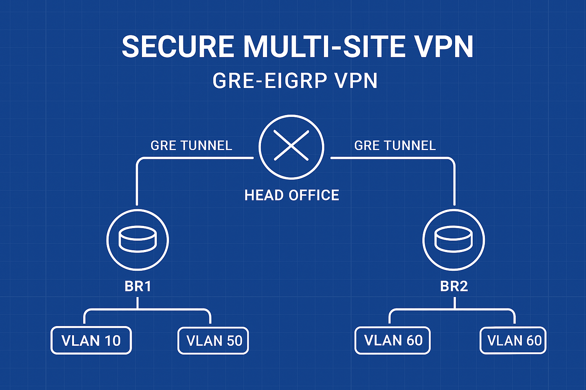
</p>


A comprehensive network simulation project demonstrating **advanced routing**, **wide-area networking (WAN)**, **quality-of-service**, and **network security** across a **Head Office (HO)** and two **Branch Offices (BR1, BR2)**.

---

## 📑 Table of Contents

1. [📘 Project Overview](#-project-overview)
2. [🎯 Project Objective](#-project-objective)
3. [🌐 Network Topology](#-network-topology)
4. [🖧 Device Interface Table](#-device-interface-table)
5. [📝 IP Addressing Table](#-ip-addressing-table)
6. [🔧 Lab Steps](#-lab-steps)
7. [💻 Device Configuration](#-device-configuration)
8. [✅ Verification Commands](#-verification-commands)
9. [⚡ How to Run Lab](#-how-to-run-lab)
10. [📂 Folder Structure](#-folder-structure)
11. [🧱 Lab Limitations](#-lab-limitations)
12. [🎓 Learning Outcomes](#-learning-outcomes)
13. [💡 Repository Info](#-repository-info)

---

## 📘 Project Overview

This project simulates a corporate network connecting a **Head Office (HO)** and two **Branch Offices (BR1, BR2)** over a simulated WAN (Internet).  
It integrates a **centralized DHCP server**, **secure routing via GRE tunnels**, and **granular access control (ACLs)**.

### 🧩 Key Technologies

- **GRE Tunnels:** Secure site-to-site VPN connections between HO and both branches.  
- **EIGRP (AS 10):** Dynamic routing across all internal networks and GRE tunnels.  
- **Router-on-a-Stick (ROAS):** Enables inter-VLAN routing at the HO.  
- **DHCP Relay (`ip helper-address`):** Centralized IP management from HO to branches.  
- **Extended ACLs:** Restrict traffic (e.g., Finance VLAN can’t access File Server).  
- **WPA2-PSK Wireless:** Secured wireless access via AP-PT access points.

---

## 🎯 Project Objective

The main objective is to build a **fully functional, secure, and scalable network** supporting:

1. **Centralized IP Management:** All clients receive IPs from the HO DHCP server.  
2. **Full Connectivity:** End-to-end reachability between all sites.  
3. **Security Enforcement:** Finance VLAN (20) restricted from File Server access.  
4. **Wireless Integration:** Secure SSID mapped into VLAN structure.

---

## 🌐 Network Topology

`/topology/topology_overview_drawio.png`

> 🖼️ 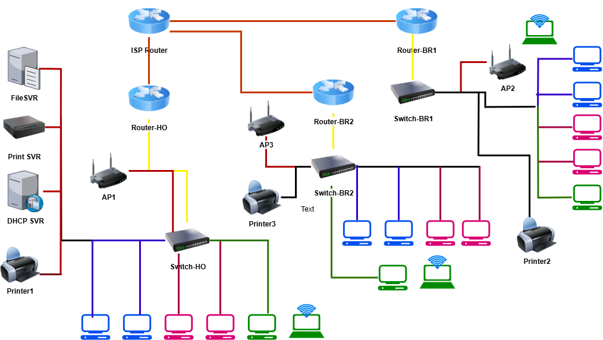

---

## 🖧 Device Interface Table

| **Device**    | **Interface**  | **Connection**         | **VLAN / Network**    | **Notes**                      |
|---------------|----------------|------------------------|-----------------------|--------------------------------|
| **Route_HO**  | G0/0           | WAN to ISP             | 203.0.113.0/30        | Main Internet Link             |
|               | G0/1           | LAN Trunk to Switch_HO | Trunk                 | Router-on-a-Stick Port         |
|               | T1             | VPN to BR1             | 10.10.10.0/30         | GRE Tunnel Overlay             |
|               | T2             | VPN to BR2             | 10.10.20.0/30         | GRE Tunnel Overlay             |
| **Route_BR1** | G0/0           | WAN to ISP             | 203.0.113.4/30        | Public Link to HO              |
|               | G0/1           | LAN to Switch_BR1      | 192.168.50.0/24       | DHCP Helper configured         |
| **Route_BR2** | G0/0           | WAN to ISP             | 203.0.113.8/30        | Public Link to HO              |
|               | G0/1           | LAN to Switch_BR2      | 192.168.60.0/24       | DHCP Helper configured         |
| **ISP_Router**| G0/0           | Link to HO             | 203.0.113.0/30        | Connects to HO (203.0.113.1)   |
|               | G0/1           | Link to BR1            | 203.0.113.4/30        | Connects to BR1 (203.0.113.6)  |
|               | G0/2           | Link to BR2            | 203.0.113.8/30        | Connects to BR2 (203.0.113.10) |
| **Switch_HO** | G0/1           | Trunk to Route_HO      | All VLANs             | Router Trunk                   |
|               | F0/1           | Access Point           | VLAN 30 (IT_Wireless) | Wired to AP                    |
|               | F0/4–F0/6      | Servers                | VLAN 100              | Server Farm                    |


---

## 📝 IP Addressing Table
   
| Network Name      | VLAN ID | Network Address  | Gateway         | DHCP Range  |
| :---------------- | :------ | :--------------- | :-------------- | :---------- |
| **HO - HR**       | 10      | 192.168.10.0/24  | 192.168.10.1    | .11 – .254  |
| **HO - Finance**  | 20      | 192.168.20.0/24  | 192.168.20.1    | .11 – .254  |
| **HO - Wireless** | 30      | 192.168.30.0/24  | 192.168.30.1    | .11 – .254  |
| **HO - Servers**  | 100     | 192.168.100.0/24 | 192.168.100.1   | .13 – .254  |
| **BR1 - LAN**     | 50      | 192.168.50.0/24  | 192.168.50.1    | .11 – .254  |
| **BR2 - LAN**     | 60      | 192.168.60.0/24  | 192.168.60.1    | .11 – .254  |
| **VPN Tunnel 1**  | —       | 10.10.10.0/30    | HO: .1, BR1: .2 | GRE Overlay |
| **VPN Tunnel 2**  | —       | 10.10.20.0/30    | HO: .1, BR2: .2 | GRE Overlay |

---

## 🔧 Lab Steps

1. **VLAN and Trunk Setup:** Create VLANs on `Switch_HO` and assign ports.  
2. **ROAS Configuration:** Configure G0/1 sub-interfaces on `Route_HO` for VLANs 10, 20, 30, and 100.  
3. **DHCP Pools:** Configure DHCP on `Route_HO` for all VLANs and branch LANs.  
4. **WAN Setup:** Assign IPs on all routers (HO, BR1, BR2, ISP).  
5. **GRE Tunnels:** Create Tunnel1 (HO ↔ BR1) and Tunnel2 (HO ↔ BR2).  
6. **EIGRP:** Enable EIGRP (AS 10) on all networks and tunnel interfaces.  
7. **DHCP Relay:** Apply `ip helper-address` on BR1 and BR2 LAN interfaces.  
8. **ACL Configuration:** Block `192.168.20.0/24` (Finance VLAN) from accessing `192.168.100.11` (File Server).  
9. **Wireless Setup:** Configure AP-PTs with WPA2-PSK under VLAN 30.

---

## 💻 Device Configuration

All configuration files are stored in the `configs/` directory.

### 🚦 Router_HO
Contains ROAS, DHCP for all VLANs, EIGRP, GRE tunnels, and ACLs.  
```text
! DHCP Pools for all VLANs
ip dhcp pool VLAN_10_HR
network 192.168.10.0 255.255.255.0
default-router 192.168.10.1
dns-server 192.168.100.10
!
```
📄 [View Full Configuration File →](configs/router-config/router-ho.cfg)

### 🚦 Router_BR1
Includes GRE tunnel, EIGRP, and DHCP relay.  
```text
interface GigabitEthernet0/1
description BR1_VLAN_50_GW
ip address 192.168.50.1 255.255.255.0
ip helper-address 192.168.100.10  <-- DHCP Relay to HO Server
no shutdown
```
📄 [View Full Configuration File →](configs/router-config/br1-ro.cfg)


### 🚦 Router_BR2
Similar configuration as BR1.  
```text
interface Tunnel2
ip address 10.10.20.2 255.255.255.252
tunnel source GigabitEthernet0/0
tunnel destination 203.0.113.1
ip mtu 1400
tunnel mode gre ip
```
📄 [View Full Configuration File →](configs/router-config/br2-ro.cfg)


### 🚦 ISP Router
Handles static routes between HO and Branch routers.  
```text
interface GigabitEthernet0/1
ip address 203.0.113.5 255.255.255.252
description Link_to_BR1
no shutdown
```
📄 [View Full Configuration File →](configs/router-config/isp-ro.cfg)


### 🔀 Switch_HO / BR1 / BR2
Contains VLAN, trunk, and port configurations.  
```text
! G0/1: Link to Router (ROAS Trunk)
interface GigabitEthernet0/1
description TRUNK_TO_ROUTER_HO
switchport mode trunk
```
📄 [View Full Configuration File →](configs/switch-config/switch-ho.cfg)

### 🔀 Switch-BR1
```text
! G0/1: Link to Router (Access Port)
interface GigabitEthernet0/1
description ACCESS_TO_ROUTER_BR1
switchport mode access
switchport access vlan 50
```
📄 [View Full Configuration File →](configs/switch-config/switch-br1.cfg)

### 🔀 Switch-BR2
```text
! F0/1: Access Port for BR2 Wireless AP
interface FastEthernet0/1
description AP_BR2_WIRELESS
switchport mode access
switchport access vlan 60
```
📄 [View Full Configuration File →](configs/switch-config/switch-br2.cfg)

### 🖨️ Printer Configuration

No specific configuration file is needed. The server's IP is set statically in Packet Tracer's GUI.

### 🖥️ PC and Laptop Configuration

All end-user devices (PCs and Laptops) are set to **DHCP** via the static configuration in Packet Tracer's GUI.

### 📡 Server Configuration

📄 [View Full Configuration File →](configs/server-config/server-config.txt)

---

## ✅ Verification Commands

### 1. Local Connectivity (HO Inter-VLAN & DHCP)

- This section verifies that the Head Office clients can reach all local resources and the DHCP service is centralized.

1.1. Verify HR to Server VLAN routing. PC_HR1 (VLAN 10) to DHCPSVR
```text
ping 192.168.100.10 
```


1.2. Verify Finance to Printer routing. PC_FN1 (VLAN 20) to PrintSVR
```text
ping 192.168.100.12 
```
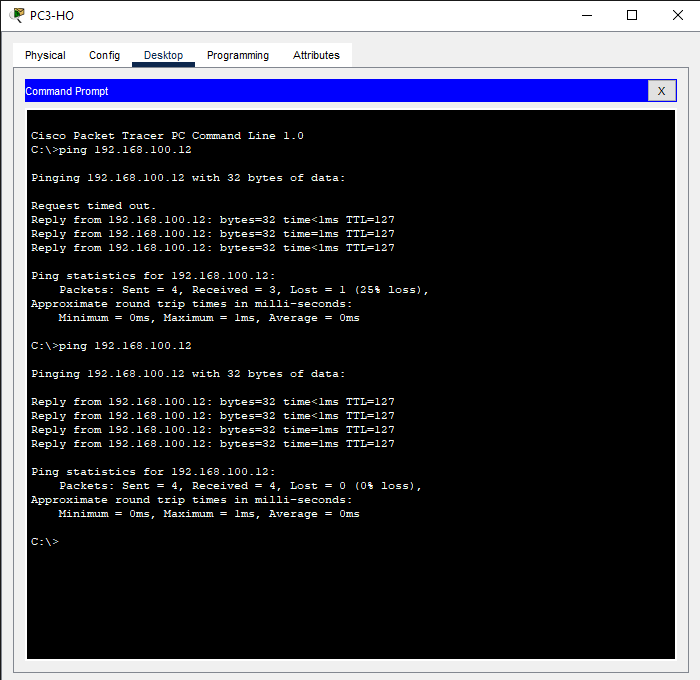

1.3. Verify IT Wireless DHCP. IT Laptop (VLAN 30)
```text
ipconfig
```
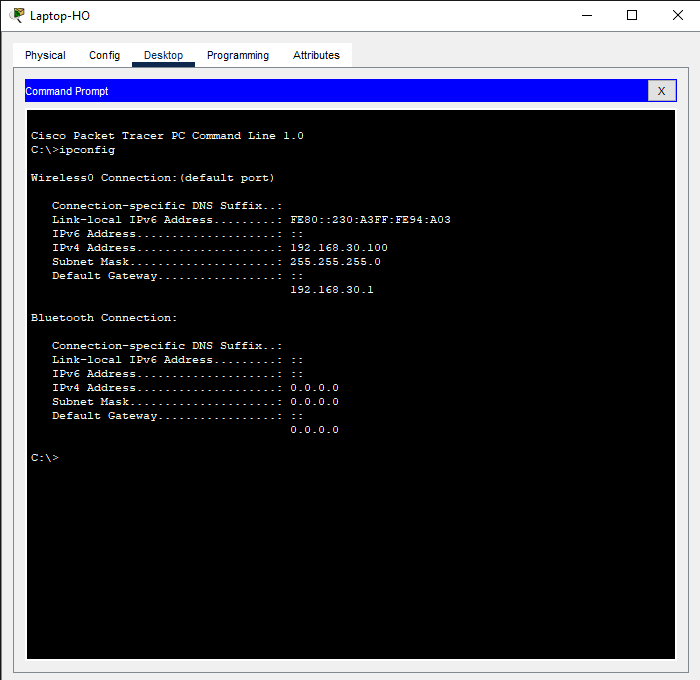

1.4. Verify Finance PC can resolve GW. PC_FN1 (VLAN 20) Router-HO G0/1.20
```text
ping 192.168.20
```
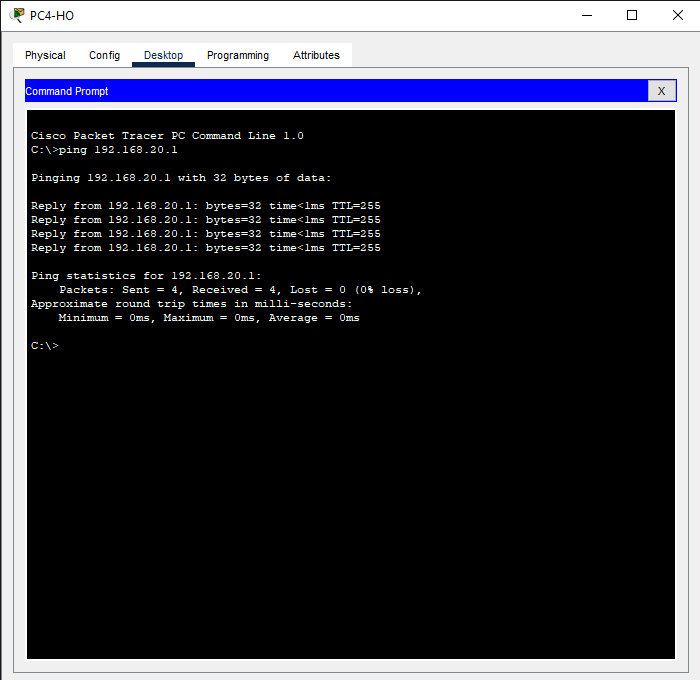

### 2. WAN Connectivity & Routing (GRE Tunnels & EIGRP)

- This verifies the remote branch offices can reach the central services via the secure GRE tunnels and EIGRP is working.

2.1. Verify BR1 to HO Server access. PC_BR1 to FileSVR
```text
ping 192.168.100.11 
```


2.2. Verify BR2 to HO Server access. PC_BR2 to DHCPSVR
```text
ping 192.168.100.10 
```
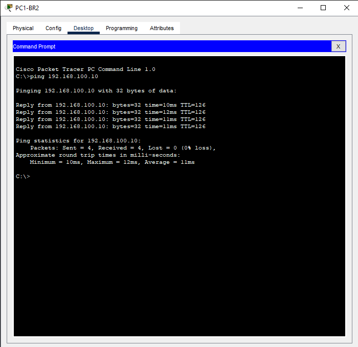

2.3. Verify Branch-to-Branch routing. PC_BR1 to Any BR2 PC
```text
ping 192.168.60.100 
```
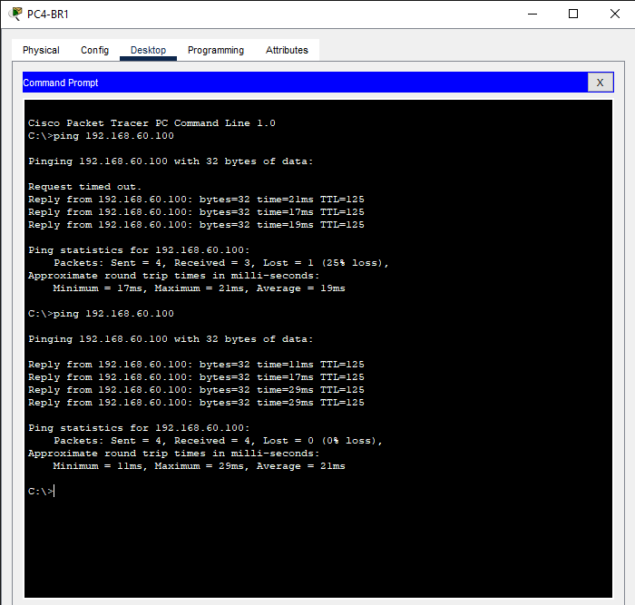

2.4. Verify EIGRP Route Table. Router HO
```text
show ip route eigrp
```
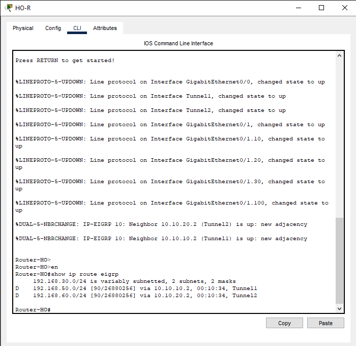

2.5. Verify Tunnel Interface Status. Route_BR1
```text
show interface tunnel 1
```
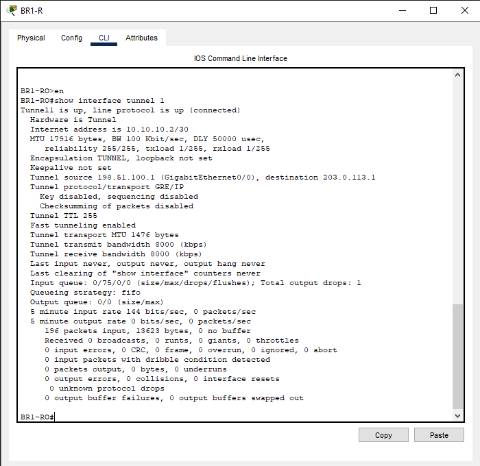

### 3. Security (ACL)

- This verifies that the Extended ACL applied to block Finance traffic to the File Server is enforced correctly.

3.1. Verify Finance restriction is enforced. PC_FN1 (VLAN 20) to FileSVR
```text
ping 192.168.100.11 
```
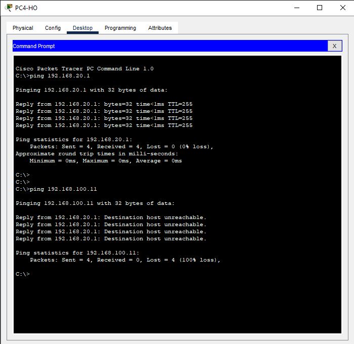

3.2. Verify HR access is allowed. PC_HR1 (VLAN 10) to FileSVR
```text
ping 192.168.100.11 
```
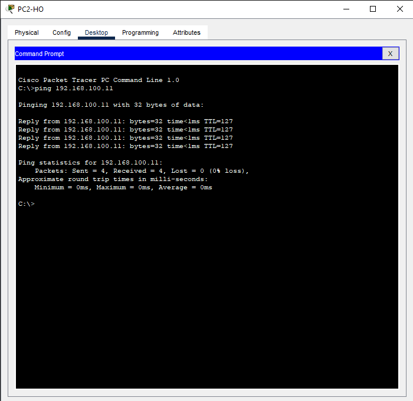

### 4. Wireless Connectivity

- This verifies that the specific IT Laptop can connect to the HO wireless network with the correct security.

4.1. Verify Wireless Security is applied. 


4.2. Verify Wireless traffic flows. IT Laptop to HR Pcs
```text
ping 192.168.10.100
```
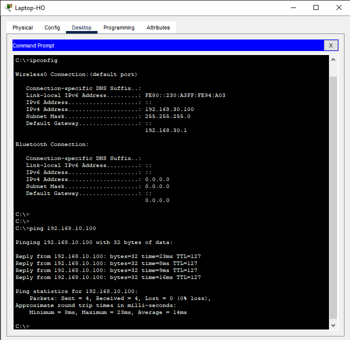

---

## ⚡ How to Run Lab

1. **Clone Repository:**  
   ```bash
   git clone https://github.com/asmymhm/Secure-MultiSite-VPN.git
2. **Open in Packet Tracer:**
   Open secure_multisite_vpn.pkt.

3. **Power On Devices:**
   Wait 60 seconds for EIGRP and STP to converge.

4. **Test:**
   Run verification commands above.

---

## 📂 Folder Structure

Secure-MultiSite-VPN/
├── configs/
│   ├── router-config/
│   │   ├── router-ho.cfg
│   │   ├── br1-ro.cfg
│   │   ├── br2-ro.cfg
│   │   ├── isp-r.cfg
│   │
│   ├── switch-config/
│   │   ├── switch-ho.cfg
│   │   ├── switch-br1.cfg
│   │   └── switch-br2.cfg
│   └── server-config/
│       └── server-config.txt
│
├── drwaio/
│   └── secure_multisite_vpn.drawio/
│
├── lab-file/
│   └── secure_multisite_vpn.pkt
│
├── topology/
│   ├── banner.png
│   ├── topology_overview.png
│   └── topology_overview_drawio.png
│
├── screenshots/
│   ├── L1_HR_to_DHCPSRV.png
│   ├── L2_FN_to_PrintSVR.png
│   ├── L3_IT_Wireless_IP.png
│   ├── L4_FN_to_GW.png
│   ├── S1_FN_ACL_Deny.png
│   ├── S2_HR_ACL_Permit.png
│   ├── WL1_IT_Wireless_Connect.png
│   ├── WL2_IT_to_HR_Ping.png
│   ├── W1_BR1_to_FileSVR.png
│   ├── W2_BR2_to_DHCPSRV.png
│   ├── W3_BR1_to_BR2.png
│   ├── W4_HO_EIGRP_Table.png
│   └── W5_BR1_Tunnel_Status.png
│
├── README.md
├── verification.md
└── .gitignore

---

## 🧱 Lab Limitations

This lab was built in Cisco Packet Tracer, which has the following limitations:

- **No File System Security:** The requirement to restrict folder access (e.g., Finance users cannot access the File Server) had to be implemented at the **Network Layer** using an 
  **Extended ACL** (denying all traffic from $192.168.20.0/24$ to $192.168.100.11$). Actual file/folder permissions (NTFS or equivalent) are not supported.
- **Access Point Limitations:** The AP-PT device is a pure Layer 2 bridge and does not support assigning a static management IP address, limiting out-of-band management options.

---

## 🎓 Learning Outcomes

1. Designed a **hub-and-spoke** **GRE-EIGRP VPN topology**

2. Implemented centralized DHCP and relay agents.

3. Applied **access control policies** using Extended ACLs.

4. Integrated **wireless and VLAN networks securely**.

5. Verified and troubleshot using Cisco CLI commands.

---

## 💡 Repository Info

- **Author:** Mohamed Asmy

- **Project Name:** Secure Multi-Site Connectivity (GRE-EIGRP VPN)

- **Platform:** Cisco Packet Tracer (Version 8.x)

- **License:** MIT 

---

